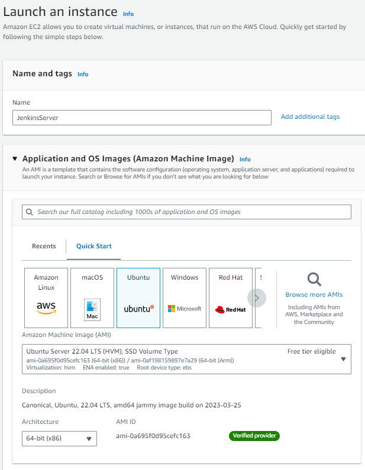
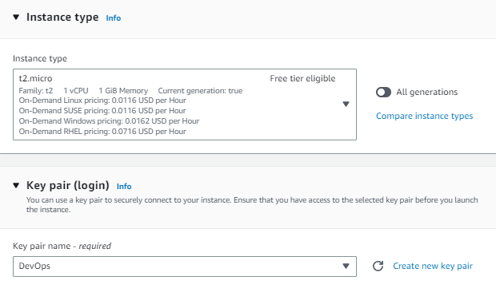
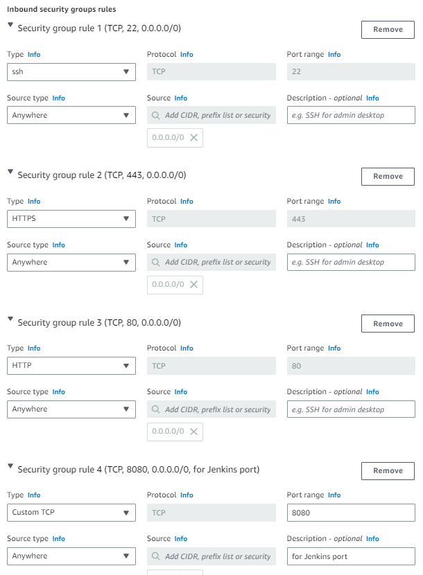
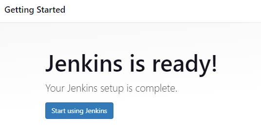
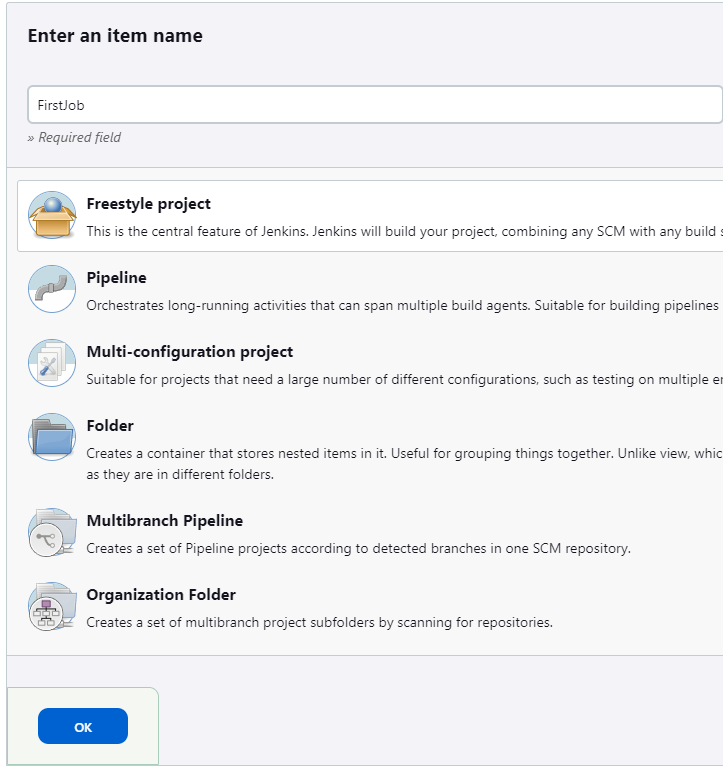

# Jenkins_CICD_GitHub
#
## Why integrate GitHub with Jenkins
* You can and should use Jenkins with GitHub to save time and keep your project up-to-date. One of the basic steps of implementing CI/CD is integrating your SCM (Source Control Management) tool with your CI tool. This saves you time and keeps your project updated all the time
#
## Benefits:
* Jenkins creates workflows using Declarative Pipelines, which are similar to GitHub Actions workflow files. Jenkins uses stages to run a collection of steps, while GitHub Actions uses jobs to group one or more steps or individual commands. Jenkins and GitHub Actions support container-based builds.
* Each commit can be traced back to its respective workitem at any given point in time from GitHub itself.
* Enforced checkpoints ensure that no mandatory steps/checks are missed while making a commit – this leads to high success rate for commits.
#
## 1. Launch an AWS Instance
* Launch a new instance with any name (Jenkins_Server)
* Select Ubuntu under AMI and  t2.micro in Instance Type

* Create new Key pair and attached under key pair name
* Tick Allow HTTPS, HTTP traffic from internet

* Hit Launch Instance
* Installing Jenkins
### Reference [here](https://www.jenkins.io/doc/book/installing/linux/#debianubuntu)

#
## 2. Create first job in Jenkins

